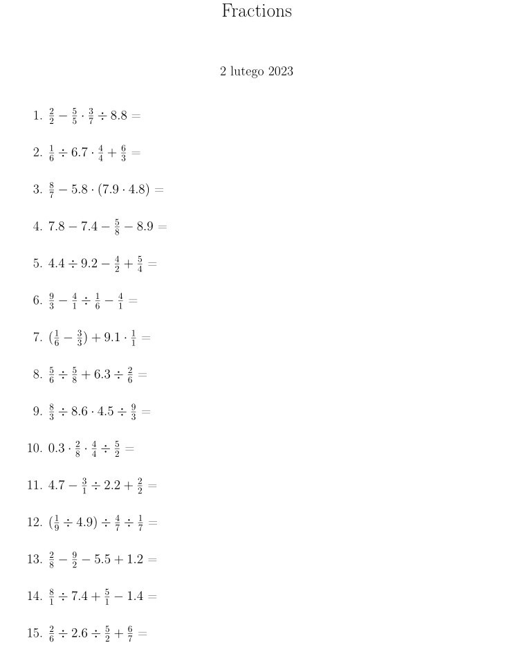

# A simple Python program for creating a LaTeX document with fractional equations for elementary school students

---

The goal of this program is to generate math problems for kids struggling with
basic arithmetics and algebra. This program put my niece through her final years
of elementary school by giving her 8 equations to solve every day.

## Example



A sample output of the program, after linking the 'poczatek.tex'
and 'koniec.tex' and compiling it with pdfLaTeX. The .tex and .pdf files
for the example are in the repository.

## Features

The equations contain simple fractions as well as decimals. In order to test
the order of operations ([PEMDAS](https://en.wikipedia.org/wiki/Order_of_operations#Mnemonics))
the program can generate paratheses around arbitrary number of fractions present
in the equation. The math actions present in the equations consists only of
addition, substraction, division and multiplication.

## Usage

In order to generate the appropriate equations you need to run the following command:

```bash
python zadania.py > zadania.tex
```

An optional integer argument after zadania.py provides the seed for the RNG
(in order to be able to control the randomness of the RNG). By default the 
program is seeded with the current day's number since 2018 and as such the 
default program will always generate the same equations throughout a single
day unless a seed number is provided.

The next command should be to use to link the provided 'poczatek.tex' and 'koniec.tex'
templates for a LaTeX document, that enable the pdfLaTeX compilation. The command
can be:

```bash
cat poczatek.tex zadania.tex koniec.tex > output.tex
```

Finally, in order to compile the tex file you could run:

```
pdflatex output.tex
```

